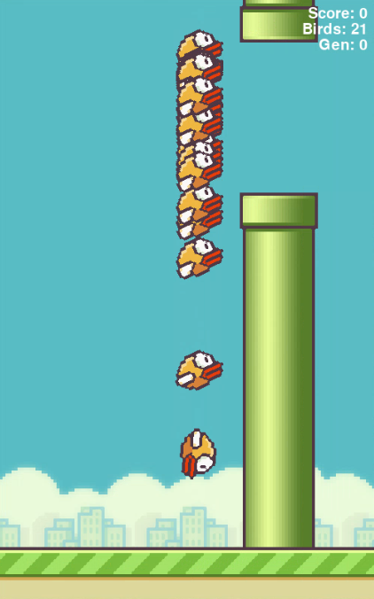
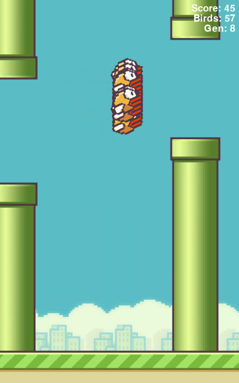
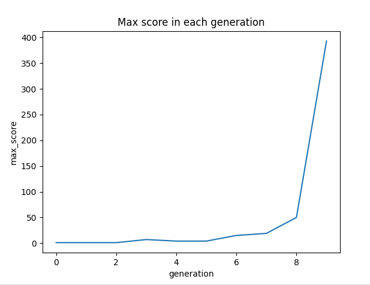
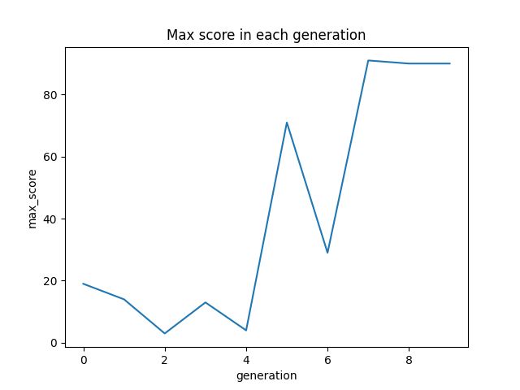
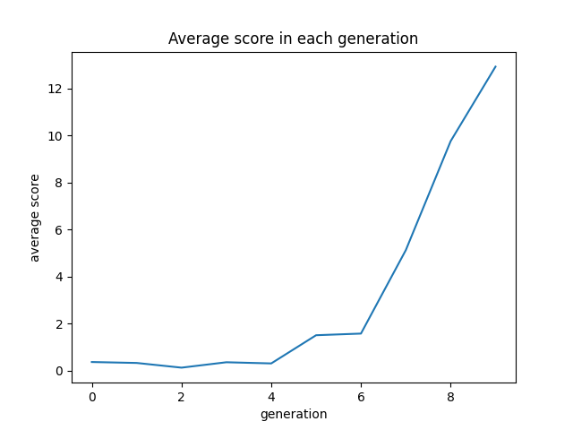
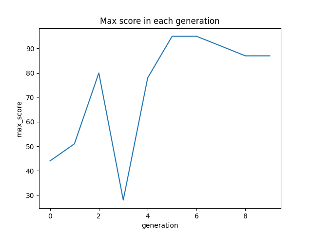
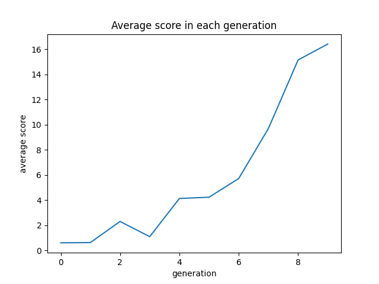

# Genetic Algorithm based FlappyBird player from scratch

Hello guys. This is a simple Flappybird game developed using genetic algorithms. The game is developed using pygame. I basically got the game from [techwithtim](https://github.com/techwithtim/NEAT-Flappy-Bird) and programmed the GA from scratch. 

## How GA works

“A genetic algorithm is a search heuristic that is inspired by Charles Darwin’s theory of natural evolution. This algorithm reflects the process of natural selection where the fittest individuals are selected for reproduction in order to produce offspring of the next generation.”

In this game birds are individuals in the population. Their task is to pass through the pipes without colliding with them. Jump is the only ability that one can perform. 

Each bird inherits 4 parameters which are W1, W2, W3 and Bias. I let them use these parameters to decide when to jump according to the following algo

`jump if (W1 x A + W2 x B + W3 x C + Bias ) > 0`

First I generate 100 birds with random weight values. Then l let them play. Few birds passed through the first pipe and eventually all of them died. Then the selection process selects the best individuals out of the starting population to generate the next population using crossover and mutation. In my crossover function, it will get the average of weight values to find weight values for the next generation. In mutation, it will change one weight value randomly of an individual to create another.

Mutation percentage I used is 10% throughout the process. As you can see after a few iterations birds tend to perform better than their ancestors. 

This is a one result I got. It took so much time so I limited the max score to 100 so then I can get the data quickly. And also I changed the gap between pipes randomly from 170 to 220 to make the game a little bit harder. 

Few results

 

 
